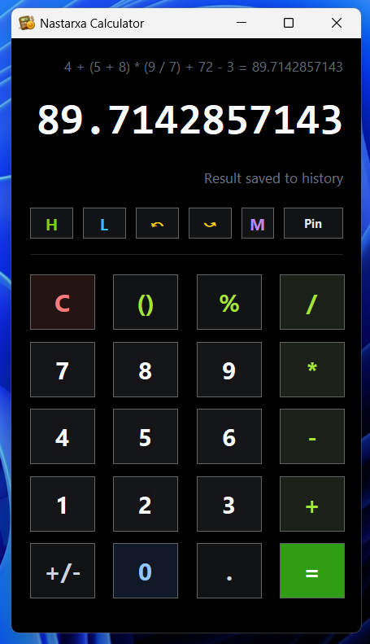

# 🧮 Nastarxa Calculator

> 📱 Android-style calculator with history, memory functions, timer lap analysis, OCR imports, and export tools.

A lightweight desktop calculator built with AutoHotkey v2 that combines everyday calculations with timer lap parsing, OCR-based screenshot imports, and report exports.


---

## 🖼 Image Preview



---

## ✨ Features

### 🧮 Calculator

* Android-style calculation workflow
* Expression remains visible after evaluation
* Expression editing by clicking the expression or display
* Undo / Redo support
* Memory functions (`MC`, `MR`, `M+`, `M-`, `MS`)
* Colored button UI with hover and click feedback
* Always-on-top pin toggle with saved state

### 📜 History

* Persistent calculation history
* Selectable history entries
* Copy selected entry
* Copy entire history
* Reload previous calculations
* Clear saved history

### ⌨ Hotkeys

* Calculator-scoped hotkeys using `HotIfWinActive`
* Global calculator show/hide toggle (`F12`)
* Quick access to Help (`F1`)
* Keyboard-driven calculator workflow

### ⏱ Timer Lap Analysis

* Import timer data from files
* Drag & drop support
* OCR import from timer screenshots
* Automatic lap parsing
* Lap summary statistics

### 📤 Export

* Export lap reports as text (`.txt`)
* Export styled lap reports as images (`.png`)
* Automatic timestamped filenames
* Safe duplicate filename handling

---

## 📦 Requirements

* Windows 10 or newer
* AutoHotkey v2
* PowerShell (included with Windows)
* Windows OCR components (for image imports)

---

## 🚀 Usage

1. Launch:

```txt
Nastarxa Calculator.ahk
```

2. Use the calculator normally:

   * Click buttons
   * Use keyboard shortcuts
   * Review history
   * Store memory values

3. Open:

   * **H** for History
   * **L** for Lap Analysis

4. Export reports when needed.

---

## ⌨ Hotkeys

Most calculator hotkeys only work while the calculator window is active.

| Key            | Action                         |
| -------------- | ------------------------------ |
| `0-9`          | Number input                   |
| `.`            | Decimal point                  |
| `+ - * /`      | Operators                      |
| `Enter`        | Calculate                      |
| `Backspace`    | Delete digit                   |
| `Esc`          | Clear                          |
| `Ctrl+Z`       | Undo                           |
| `Ctrl+Shift+Z` | Redo                           |
| `Ctrl+C`       | Copy current expression/result |
| `Ctrl+T`       | Toggle Always On Top           |
| `F1`           | Help                           |
| `F12`          | Show / Hide Calculator         |

---

## 📜 History

Open the History window using the **H** button.

Features:

* Select individual calculations
* Copy selected entry
* Copy all history entries
* Reload previous calculations
* Clear stored history

Reloaded calculations restore the original expression while displaying the evaluated result.

Example:

```txt
1 + 1 + 2 = 4
```

Loading this entry restores:

```txt
Expression: 1 + 1 + 2
Result:     4
```

---

## ⏱ Timer Lap Import

Open the Laps window using the **L** button.

Supported formats:

```txt
.txt
.csv
.tsv
.log
.png
.jpg
.jpeg
.bmp
```

### OCR Screenshot Support

Timer screenshots can be imported using Windows OCR.

Supported image formats:

```txt
.png
.jpg
.jpeg
.bmp
```

### Parsing Rules

The lap reader is layout-based:

* Each non-empty row is processed independently
* The last detected time value becomes the elapsed time
* Text before the time becomes the lap name
* Lap names may vary without breaking parsing

Difference calculation:

```txt
Current Lap Time - Previous Lap Time
```

### Supported Time Formats

```txt
00:12.345
1:02:03.456
12.345s
12345ms
2.5 min
```

---

## 📊 Lap Statistics

Generated summaries include:

* Total laps
* Total work time
* Fastest lap
* Slowest lap
* Average lap
* Individual lap differences

Example output:

```txt
Lap 01  00:15.321
Lap 02  00:30.842  d +15.521
Lap 03  00:45.991  d +15.149
```

---

## 📤 Export

The Laps window supports two export formats.

### TXT Export

Exports a plain text report containing:

* Work time
* Total laps
* Fastest lap
* Slowest lap
* Average lap
* Individual lap data

### PNG Export

Exports a styled image report suitable for sharing or archiving.

Example filename:

```txt
laps_2026-06-14_12-45-30.png
```

If the file already exists, a safe suffix is automatically added:

```txt
laps_2026-06-14_12-45-30_01.png
```

---

## 📁 File Structure

| File                      | Description                           |
| ------------------------- | ------------------------------------- |
| `Nastarxa Calculator.ahk` | Main application                      |
| `calculator_history.txt`  | Stored calculations                   |
| `last_laps_raw.txt`       | Last imported lap data                |
| `settings.ini`            | Calculator settings and memory values |
| `sample_laps.txt`         | Example lap import file               |

---

## ⚙ How It Works

The calculator stores structured calculation data rather than relying on visible display text.

Internal state:

```txt
tokens
current
result
justEvaluated
```

This allows Android-style behavior:

```txt
1 + 1
1 + 1 + 2
1 + 1 + 2 = 4
```

After pressing `=`, entering another operator automatically continues from the previous result.

---

## 🔧 Helper Scripts

| Script                          | Purpose                               |
| ------------------------------- | ------------------------------------- |
| `src/tools/ocr_timer_image.ps1` | OCR extraction from timer screenshots |
| `src/tools/render_laps_png.ps1` | Generate styled PNG reports           |

---

## 📄 License

MIT

See [LICENSE](/LICENSE).

---

## ⚠️ Disclaimer

This project was developed with the assistance of AI tools.

AI was used to support code writing, refactoring, and documentation, while the design direction, features, and final implementation were guided and reviewed by the author.
